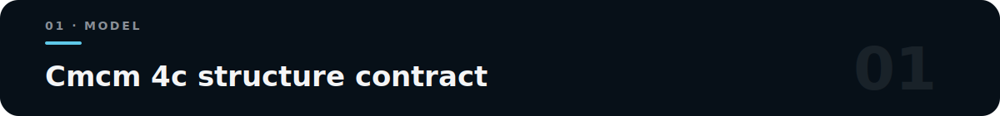
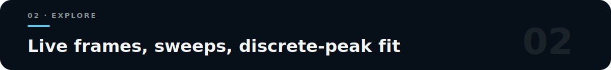

<p align="center">
  
</p>

# CrystalShift XRD

**How lattice, Wyckoff `y`, basal shuffle, and energy move powder peaks and F².**

Streamlit workbench for theoretical powder XRD of orthorhombic **`Cmcm 4c`**. Version `2.3.0` · export schema `2.3`.

> Theoretical model only — not Rietveld, not absolute intensity calibration.

<p align="center">
  
</p>

```text
(0, y, 1/4), (0, -y, 3/4),
(1/2, 1/2+y, 1/4), (1/2, 1/2-y, 3/4)

shuffle_signed = 2*(y-0.25)
wavelength_A   = 12.398419843320026 / energy_keV
I_model_peak   = F² × applied_multiplicity × applied_LP × applied_volume_factor × line_weight
applied_volume_factor = 1 / V_cell when the cell-volume correction is enabled; otherwise 1
```

`R_hkl` with/without LP for experimental area post-processing (theoretical only).

### Quick start

```powershell
py -3.11 -m venv .venv
.\.venv\Scripts\Activate.ps1
python -m pip install -e ".[dev]"
python -m streamlit run app.py --server.port 8508
```

Open http://localhost:8508/

<p align="center">
  
</p>

- **Pattern** — static 2θ / q / d  
- **Live evolution** — exact precomputed frames; browser switches locally  
- **F² evolution** + structure preview along `b`  
- **Sweep / trajectory** CSV · **discrete-peak fit** diagnostics  
- Schema 2.3 ZIP + `analysis.xlsx` with hashes and checksums

Does **not** implement Rietveld/Le Bail/Pawley, texture, absorption, size/strain, zero shift, background, phase fractions, or absolute calibration.

```bash
python -m pytest -q && python -m ruff check .
```

Released under the MIT License; see [`LICENSE`](LICENSE). Cite the structure source and keep export manifests with figures.
