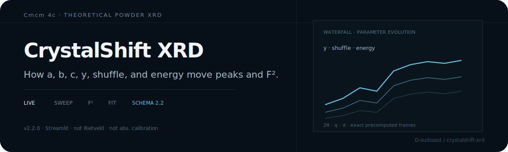

<p align="center">
  
</p>

# CrystalShift XRD

**How lattice, Wyckoff `y`, basal shuffle, and energy move powder peaks and F².**

Streamlit scientific workbench for theoretical powder XRD of an orthorhombic **`Cmcm 4c`** phase.

| | |
|---|---|
| Version | `2.2.0` |
| Export schema | `2.2` |

> **Boundary:** theoretical model only. Not Rietveld, not experimental intensity calibration, not absolute intensity.

## Highlights

- Edit source, energy/wavelength, `a`, `b`, `c`, `y`, and shuffle on the first screen  
- Static patterns on `2θ`, `q`, or `d` axes  
- **Live evolution** — precomputed frames; browser switches locally without Python rerun per drag  
- Multi-line radiation sources preserved under live energy/wavelength changes  
- Peak tables, HKL selection, F² evolution, heatmaps, waterfalls, structure preview  
- Discrete-peak fit diagnostics (χ² scan, local refinement, scale `S(y)`, residuals)  
- Schema **2.2** CSV/ZIP + `analysis.xlsx` with config hashes and checksums  

## Quick start

```powershell
py -3.11 -m venv .venv
.\.venv\Scripts\Activate.ps1
python -m pip install --upgrade pip
python -m pip install -e ".[dev]"
python -m streamlit run app.py --server.port 8508
```

```bash
python3.11 -m venv .venv
source .venv/bin/activate
python -m pip install -e ".[dev]"
python -m streamlit run app.py --server.port 8508
```

Open http://localhost:8508/ · Requires Python `>=3.11`, NumPy, Plotly, pymatgen, Streamlit.

## Typical workflow

1. Set energy (keV) or wavelength (Å) and lattice / `y` / shuffle (`shuffle_signed = 2*(y-0.25)`).  
2. Advanced: scattering mode, composition, 2θ window, HKL limit, profile, intensity corrections.  
3. **Pattern** for static views; **Live evolution** for one-parameter exploration.  
4. **F² evolution** + structure preview for `Cmcm 4c` sites along `b`.  
5. **Sweep** for batch axes (export disables if config goes stale until re-run).  
6. Optional discrete-peak fit: enter ≥2 observations, review diagnostics, apply `y*`.  

## Live evolution

- Frames in NumPy `float64`; browser gets compact `float32` drawing payloads  
- Slider `input` switches exact frames locally; `change` commits to main state  
- Baseline fixed until **Set current as baseline**; difference is vs baseline, not experimental residual  
- Active axes: `y`, shuffle magnitude, `a`/`b`/`c`, energy, wavelength  

## Scientific contract

```text
(0, y, 1/4), (0, -y, 3/4),
(1/2, 1/2 + y, 1/4), (1/2, 1/2 - y, 3/4)

shuffle_signed = 2 * (y - 0.25)
shuffle_magnitude = abs(shuffle_signed)
wavelength_A = 12.398419843320026 / energy_keV
```

`y` is canonical; signed shuffle is 1–1 with `y`; magnitude is 2–1 (branch required). Sites move strictly along `b`.

```text
I_model_peak = F2 * multiplicity * LP * volume_factor * radiation_line_weight
R_hkl_with_LP = multiplicity * F2 * LP / V_cell^2
R_hkl_no_LP   = multiplicity * F2 / V_cell^2
```

`R` factors always use crystallographic multiplicity and raw LP (ignore correction toggles); not absolute intensity. All intensity fields are **calculated model values**.

## Sweep limits

| Axis | Range |
| --- | --- |
| `y` | 0 … 0.5 |
| `shuffle_magnitude` | 0 … 0.5 |
| `a,b,c` (Å) | 1 … 20 |
| `energy_keV` | 1 … 200 |
| `wavelength_A` | 0.05 … 5 |

Trajectory CSV columns: `step_label,a_A,b_A,c_A,y,shuffle_magnitude,shuffle_branch,energy_keV,wavelength_A`. Caps: 1001 steps, large spectrum/peak/ZIP limits (see in-app docs).

## Model boundaries

Does **not** implement full-pattern Rietveld/Le Bail/Pawley, texture, absorption/fluorescence, anomalous dispersion, size/strain broadening, zero shift, background, phase fractions, or absolute calibration.

## Development

```bash
python -m pytest -q
python -m ruff check .
python -m basedpyright
```

Browser component: `frontend/` (`bun install` · `bun test` · `bun run build`). Generated `orthoxrd/_live_component/live-component.js` is kept for Streamlit runtime.

## Layout

```text
app.py · orthoxrd/ · frontend/src/ · tests/ · DESIGN.md · pyproject.toml
```

## License and citation

No open-source license file is selected yet — publication of the source does **not** grant permission to redistribute modified versions until a `LICENSE` is added.

For scientific use, cite the underlying `Cmcm 4c` structure source and keep exported `config.json`, `manifest.json`, version, and configuration hash with any derived figure.
